# 🔧 StackFix Bot

> AI-powered bug fixing from stacktraces or plain English. Automatically analyzes errors, implements fixes, and creates pull requests.

[](https://github.com/features/actions)
[](https://github.com/github/gh-aw)

> **⚠️ Hackathon Project - Work in Progress**
> This project was created for a hackathon and is actively being developed. Expect breaking changes and rapid iteration.

## ✨ Features

- 💬 **Flexible Input**: Accepts stacktraces OR human-readable descriptions ("My button doesn't work")
- 🔍 **Intelligent Analysis**: Parses errors and identifies root causes
- 🔧 **Automated Fixes**: Implements fixes for common error patterns
- 🎯 **Smart Decisions**: Creates PRs for fixable issues, Issues for complex problems
- 🌐 **Cross-Repository**: Works with any public GitHub repository
- 📝 **Detailed Reports**: Comprehensive PR descriptions with problem analysis
- ⚡ **Production Ready**: Battle-tested with safety checks and error handling

## 🚀 Quick Start

### Installation (1 command)

```bash
gh aw add stackfix-bot/action/stackfix
```

That's it! `gh aw add` automatically downloads and compiles the workflow for you.

**Prerequisites:** Install gh-aw extension first: `gh extension install github/gh-aw`

### Configuration

1. **Configure repository permissions**:
   - Go to: `Settings` → `Actions` → `General` → `Workflow permissions`
   - Select: ✅ **Read and write permissions**
   - Enable: ✅ **Allow GitHub Actions to create and approve pull requests**

2. **Add required secret**:
   - Go to: `Settings` → `Secrets and variables` → `Actions`
   - Add: `COPILOT_GITHUB_TOKEN` ([Get token here](https://github.github.com/gh-aw))

3. **Commit and push**:
   ```bash
   git add .github/workflows/
   git commit -m "Add StackFix Bot workflow"
   git push
   ```

## 📖 Usage

### Via GitHub UI

1. Go to **Actions** tab in your repository
2. Select **"Automated Bug Fix Workflow"**
3. Click **"Run workflow"**
4. Enter your bug description (either format works):
   - **Stacktrace**: `"TypeError: Cannot read property 'name' of undefined at getUserName (src/user.js:42)"`
   - **Plain English**: `"My checkout button doesn't work when I click it"`
5. Click **"Run workflow"**

The bot will analyze your repository, implement a fix, and create a PR!

### Via API

```bash
# With stacktrace
curl -X POST \
  -H "Authorization: Bearer YOUR_GITHUB_TOKEN" \
  https://api.github.com/repos/YOUR_USERNAME/YOUR_REPO/actions/workflows/stackfix.lock.yml/dispatches \
  -d '{
    "ref":"main",
    "inputs":{
      "issue":"Error: Cannot read property '\''name'\'' of undefined\n    at getUserName (src/user.js:42:15)"
    }
  }'

# With human-readable description
curl -X POST \
  -H "Authorization: Bearer YOUR_GITHUB_TOKEN" \
  https://api.github.com/repos/YOUR_USERNAME/YOUR_REPO/actions/workflows/stackfix.lock.yml/dispatches \
  -d '{
    "ref":"main",
    "inputs":{
      "issue":"My checkout button doesn'\''t work when clicking it"
    }
  }'
```

**API Invocation Steps:**

1. **Get your GitHub token**: Settings → Developer settings → Personal access tokens → Generate new token (classic)
   - Required scopes: `repo`, `workflow`

2. **Replace placeholders**:
   - `YOUR_GITHUB_TOKEN` → Your personal access token
   - `YOUR_USERNAME/YOUR_REPO` → Your repository (e.g., `acme/my-app`)

3. **Run the curl command** - The bot will analyze your repo and create a PR!

**Response**: You'll get a `204 No Content` response if successful. Check the Actions tab to see the workflow running.

### Via GitHub CLI

```bash
# With stacktrace from file
gh workflow run stackfix.lock.yml \
  -f issue="$(cat error.log)"

# With human-readable description
gh workflow run stackfix.lock.yml \
  -f issue="My checkout button doesn't work"
```

## 📋 Examples

### Example 1: Human-Readable Description

**Input:**
```
issue: "My checkout button doesn't work when I click it"
```

**What the bot does:**
- Searches for "checkout" and "button" in the codebase
- Finds `CheckoutButton.jsx` component
- Discovers missing event handler binding
- Implements fix: `onClick={this.handleCheckout}` → `onClick={this.handleCheckout.bind(this)}`
- Creates PR with explanation

### Example 2: JavaScript Runtime Error (Stacktrace)

**Input:**
```
issue: |
  TypeError: Cannot read property 'name' of undefined
      at getUserName (/src/user.js:42:15)
      at processUser (/src/processor.js:18:22)
      at main (/src/index.js:10:5)
```

**Output:** Pull request with:
- Added null check before accessing `user.name`
- Defensive programming pattern
- Test case for undefined user

### Example 3: Python Import Error

**Input:**
```
issue: |
  ImportError: No module named 'requests'
      at import_module (app.py:1)
```

**Output:** Pull request with:
- Added `requests` to `requirements.txt`
- Updated documentation

### Example 4: Complex Logic Error

**Input:**
```
issue: |
  AssertionError: Expected 100, got 99
      at calculateTotal (lib/billing.js:156:8)
```

**Output:** Issue with:
- Analysis of the calculation logic
- Multiple possible root causes
- Recommendations for investigation
- No automated fix (requires business logic understanding)

## 🔧 How It Works

```mermaid
flowchart TD
    A[Input: Repository + Stacktrace] --> B[Clone Repository]
    B --> C[Parse Stacktrace]
    C --> D[Analyze Error]
    D --> E{Can Fix?}
    E -->|High Confidence| F[Implement Fix]
    E -->|Low Confidence| G[Create Issue]
    F --> H[Run Tests/Linters]
    H --> I[Create Pull Request]
    G --> J[Create Detailed Issue]
    I --> K[Done ✅]
    J --> K
```



### Decision Logic

**Creates Pull Request when:**
- Error location is clear and specific
- Root cause is identifiable
- Fix is straightforward and safe
- No architectural changes needed
- Low risk of breaking other code

**Creates Issue when:**
- Error is vague or has multiple possible causes
- Fix requires business logic understanding
- Architectural decisions needed
- Multiple files need coordinated changes
- Insufficient context to determine root cause


